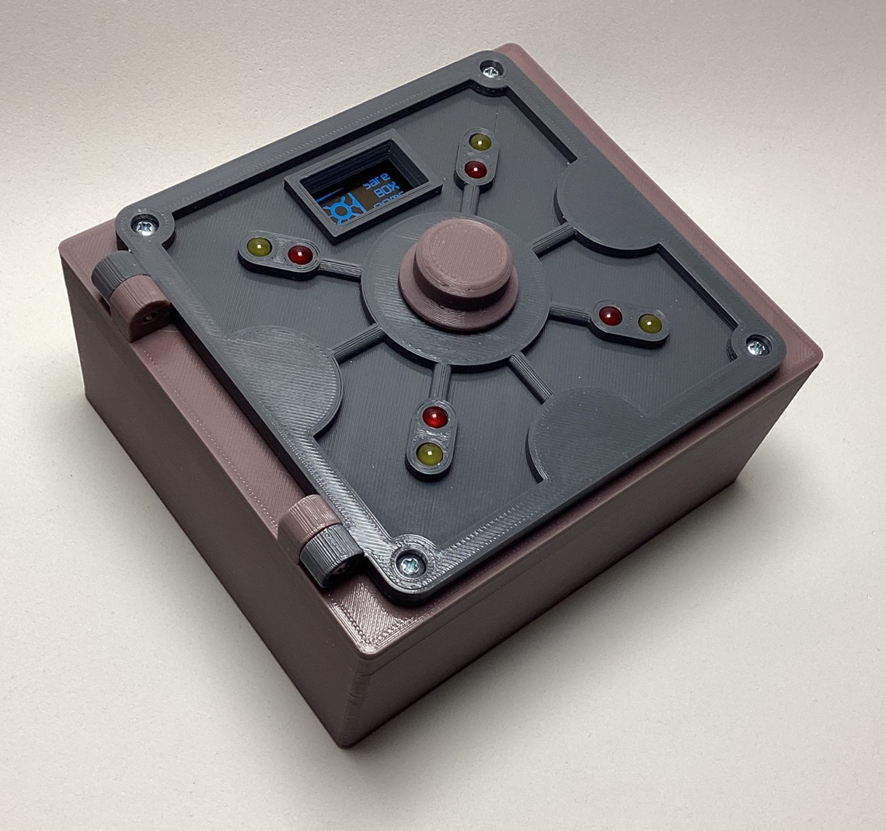

# Safe BOX GAME puzzle-box

This is a **funny puzzle-box** game in which you have to try to guess -using the lights- the correct four digit code to open the safe box.

This puzzle-box game was inspired by and based on [this project](https://www.the-diy-life.com/crack-the-code-game-built-into-a-diy-safe-puzzle-box/), making it **more compact** (it's all self-contained now), **3D printed** (instead of laser cut) and **rechargable**.

Any sugestion? Please, **contact me**.

## USAGE

The box is unlocked when it's off, so you can open the door if you want. These are the steps:

* Turn-on the system pressing the switch in the back of the door (inside the box when closed): you'll see a welcome screen.
* After that, a message appears asking you to press the knob to lock the door: close the door and press it.
* Now you have a four digit code in the screen: rotate the know to change the number, and press it to go to the next digit.
* When you press the knob in the last digit, the safe checks the combination: if it is right, the door will unlock and you'll have won; if not, it will tell you so and the *lights* will indicate how many digits were correct and how many were in the correct position.
* Repeat until you get it!

**NOTE:** there is a blinking light (every two seconds) that has NO meaning. It's just an *I'm alive* signal.

## WHY and HOW

The original project was **very very** appealing, but had **two big drawbacks** for me:

* I don't have a laser cutter (but yes a 3D-printer), and
* The control and electronic components were **too spread** (part in the door, part in the back).

Based on my experience in previous projects, I was convinced that it could be done in a much more compact form, using also a rechargable system and improving a little bit the UX (that was excellent to begin with).

And here it is the result, after a little bit more effort than I anticipated... 😅

## 3D

All the **3D parts** (available in the [`3D`](3D) folder) were created using the open-source and free software [FreeCAD](https://www.freecad.org). If you want, for example, a bigger box, go ahead and edit the 3D file to do so. In the [`STLs`](3D/STLs) subfolder reside all the STL files ready to be 3D printed, with **no supports** required at all: it's a very easy print.

There were some interesting **design challenges**, like how to make all the parts ***no-support-required*** 3D-printable, that led to interesting choices that I wouldn't have done other way: the (***good looking***) screws holding the door together are accesible from the outside, and, from a *security perspective*, that would've been disastrous... if this was a *real* safe-box. It actually became a ***handy feature***: if anything anomalous/unexpected happens (battery depletion?) and you can't open the box, you have always the option to disassemble it unscrewing those four screws 👌

Did you notice the blue dashed lines? Yep, they were added after realizing that the door was going to be **THICK** and that I needed to change the design to provide rotation clearance without making it even bigger or make a too lousy frame (compact, remember?). After some back and forth between the door, the hinges and the frame, everything  ended up really well. 

This is also the first time I've worked with [*gears & racks*](3D/servo-gearandrack), but was a nice opportunity to make the locking mechanism much more nicer than just a *big rotating contraption*, and contributed to make everything more compact. I had also to \[re\]create some parts, like the [SDD1306 oled display](https://github.com/mgesteiro/FreeCAD-models/tree/master/SSD1306_128x64), because the available models didn't match what I had at hand.

At the end, the door looks like a *real* safe-box door, with all its thickness and shape and weight ... **I ❤️ it!**.

## CONNECTIONS

This is the schematic of the system, created using the open-source software [Fritzing](https://fritzing.org) and available in the [`connections`](connections) folder.

In the original project, the servo was connected directly to the Arduino 5V output, which is generally not recommended (even for the small SG90 micro-servo**). As I opted to power everything with a 5V powerbank-DIY kit, the servo can be powered directly (althoug a capacitor in parallel is always a good idea...), making the whole device also **rechargable**.

** as it may demand quite a lot of current that the Arduino may not be able to provide and get *swamped* in the process, resetting itself.

In the physical world it was a little more difficult than I wanted, but with patience, care and some *creativity* and *dexterity*, it ended up nicely:

The most difficult part were the LEDs to the right, that had to go flat because they are under the rechargable system with very little space. The servo also played an important role in *limiting* the available space. The [3D model](#3d) was very useful to navigate all these problems beforehand and during the assembly.

## CODE

The puzzle-box is powered by an **Arduino Nano** which can be programmed with the [Arduino IDE](https://www.arduino.cc/en/software). The code itself is available in the [`code/sbg`](code/sbg) folder:

* It solves a bug in the original project's code, where there were no **9**'s in the digits, due to an incorrect use of the [`random()`](https://www.arduino.cc/reference/en/language/functions/random-numbers/random/) function.
* Nice cursor to indicate which digit is being manipulated.
* It comes with and *adhoc* library (***RotEnLib***) to manage the rotary encoder (with momentary push button) and make the code simpler while having nice features like *debouncing* and *round-robin* hidden away.
* It has some configuration parameters at the beginning (`sbg.ino`) that can be adjusted to your needs.
* There is some code to avoid the powerbank auto-shuting-down function (that's why the LEDs blink!).
* And a nice *splash screen* (see [`code/logo`](code/logo)).

## REFERENCES

* Crack-the-Box project by Michael Klemets from the The DIY Life: [www.the-diy-life.com/crack-the-code-game-built-into-a-diy-safe-puzzle-box/](https://www.the-diy-life.com/crack-the-code-game-built-into-a-diy-safe-puzzle-box/)
* Arduino `random()` function: [www.arduino.cc/reference/en/language/functions/random-numbers/random/](https://www.arduino.cc/reference/en/language/functions/random-numbers/random/)
* My FreeCAD 3D models repository: [github.com/mgesteiro/FreeCAD-models](https://github.com/mgesteiro/FreeCAD-models)
* My Fritzing parts repository: [github.com/mgesteiro/fritzing-parts](https://github.com/mgesteiro/fritzing-parts)
* **FreeCAD** 3D CAD modelling software: [www.freecad.org](https://www.freecad.org)
* **Fritzing** schematics and PCB modelling software: [fritzing.org](https://fritzing.org)

## LICENSE

This work is licensed under the [GNU General Public License v3.0](LICENSE-GPLV30). All media and data files that are not source code are licensed under the [Creative Commons Attribution 4.0 BY-SA license](LICENSE-CCBYSA40).

More information about licenses in [Opensource licenses](https://opensource.org/licenses/) and [Creative Commons licenses](https://creativecommons.org/licenses/).
